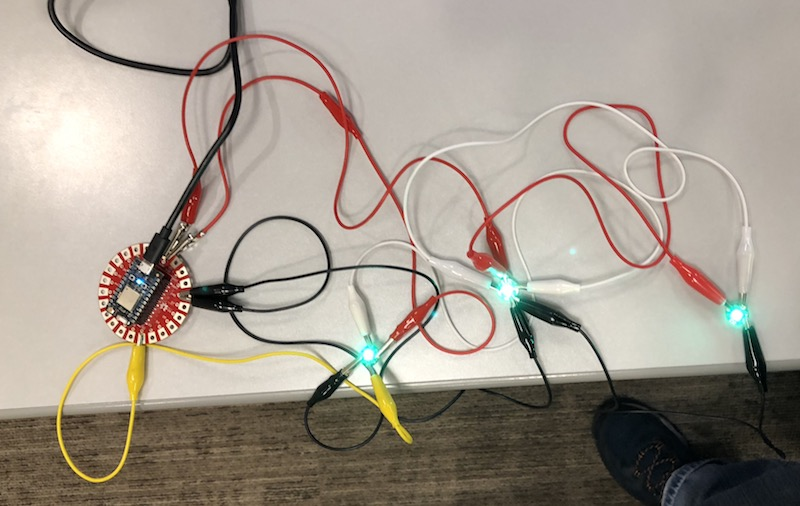
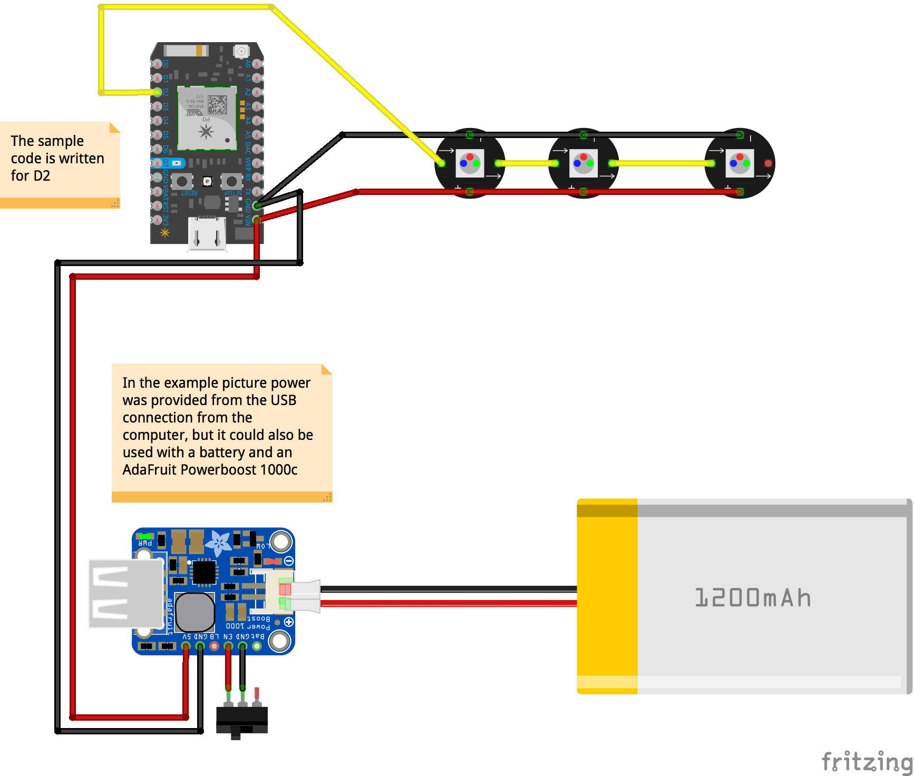

# ParticleNeoPixelHelloWorld
Basic program for chaining and testing Adafruit Flora Neopixel v2 on a Particle Photon.

# Connections

NeoPixel | Photon

(-) --> GND

(+) --> VIN

(->) --> D2

# Fritzing Diagram

